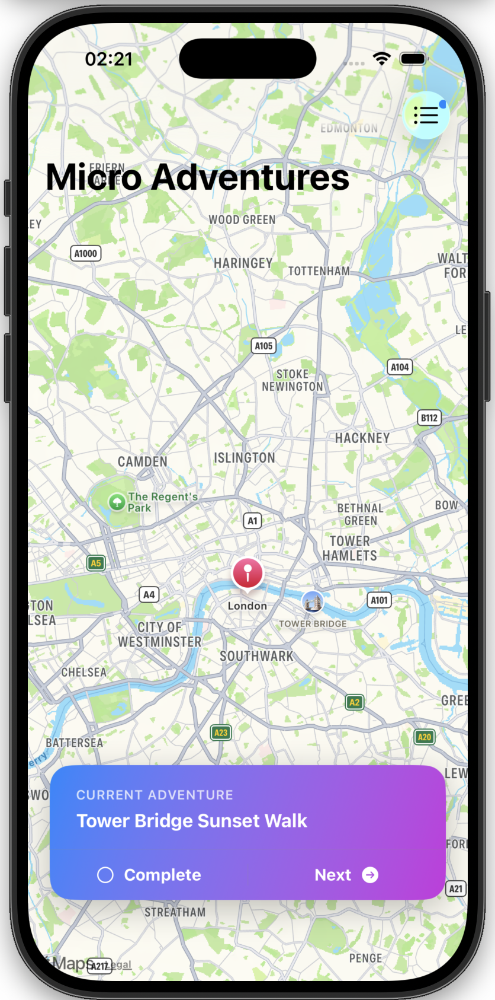
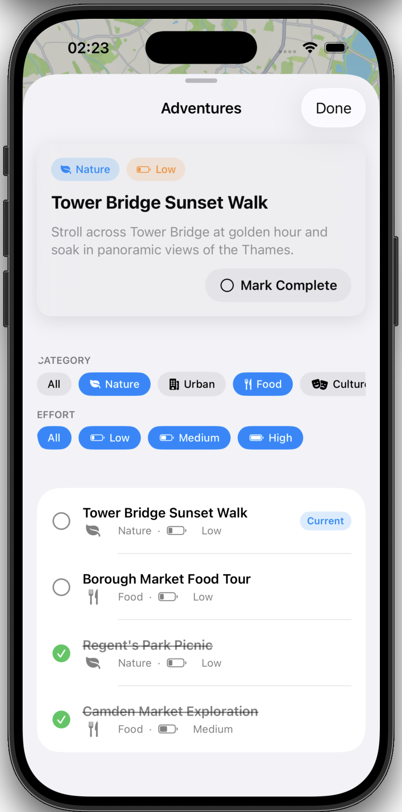

# Micro Adventures

A SwiftUI iOS app for discovering small, low-effort adventures around London. Users can browse adventures on a map, filter by category and effort level, track which ones have been completed, and step through them one at a time.

Inspired by Apple's official Code Along session: [Code Along (268)](https://developer.apple.com/events/resources/code-along-268/).

## Screenshots

<table>
  <tr>
    <td></td>
    <td></td>
  </tr>
</table>

## Features

- **Map view** — adventures are shown against a MapKit map centered on London.
- **Current Adventure card** — a floating card surfaces the active adventure with quick "Complete" and "Next" actions.
- **Skip to next** — advances to the next adventure in the list, automatically skipping over ones already marked complete, and wrapping back to the start of the list when it reaches the end.
- **Mark as complete** — toggle an adventure's completed state from either the floating card or the adventure list.
- **Filter by category & effort** — multi-select chips for `Category` (Nature, Urban, Food, Culture, Fitness, Social) and `EffortLevel` (Low, Medium, High), combined with the adventure list in a single sheet.
